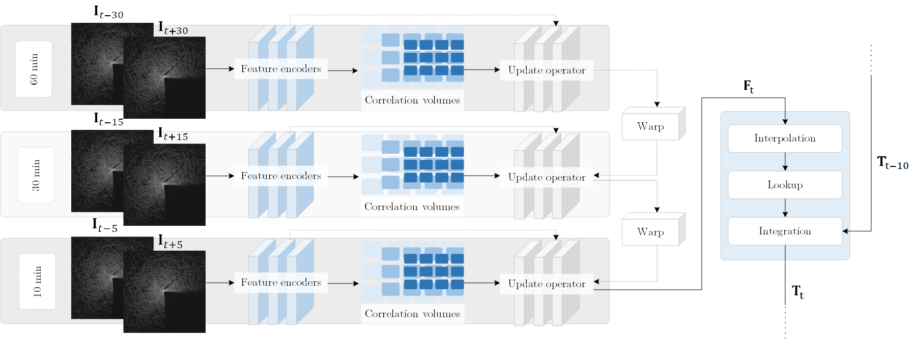

# ICE-RAFT


Deep learning-based optical flow tool for full-field analysis of deformation in radar imagery. This work builds upon the original work of RAFT (Teed and Deng, [2020](https://doi.org/10.1007/978-3-030-58536-5_24)) and the idea of differentiable warm-starting presented with E-RAFT (Gehrig, et al. [2021](https://doi.org/10.1109/3DV53792.2021.00030)) to consider a temporal multiresolution tree based on different temporal resolutions. The increased complexity enables higher accuracy in estimates and stability between different time steps needed in scientific analysis.


When using this code in research, please cite the following publication:
```bibtex
@InProceedings{UusinokaICERAFT2023,
  author = {Matias Uusinoka, Arttu Polojärvi, Jari Haapala and Mikko Lensu},
  title = {ICE-RAFT: Fine-scale deformation mapping with learning-based optical flow},
  booktitle = {Journal},
  year = {2023}
}
```

## Requirements
The code has been tested with PyTorch 1.6 and Cuda 10.1.
```Shell
conda create --name raft
conda activate raft
conda install pytorch=1.6.0 torchvision=0.7.0 cudatoolkit=10.1 matplotlib tensorboard scipy opencv -c pytorch
```

## Demo
ICE-RAFT can easily be used with the default models provided by [Pytorch](https://pytorch.org/vision/main/models/generated/torchvision.models.optical_flow.raft_large.html#torchvision.models.optical_flow.raft_large). Using a specific model can be indicated with the algorithm arguments.

You can demo a trained model on a sequence of frames
```Shell
python demo.py --model=models/raft-things.pth --path=demo-frames
```

## Arguments

### Displacement_Production.py
```--day_range``` : The starting and ending day of the period to be analyzed.

```--month_and_year``` : The month and year to be analyzed.

```--image_path``` : Indicate the path to the images to be analyzed.

```--image_resolution``` : At what resolution will the images be analyzed?

```--displacement_resolution``` : Define temporal resolution for producing the displacements.

```--temporal_scales``` : Resolutions on which the temporal resolution tree will be built.

```--update_iterations``` : The number of iterations done by each layer in the resolution tree.


### Trajectories_Strains_Deformation.py
```--day_range``` : The starting and ending day of the period to be analyzed.

```--month_and_year``` : The month and year to be analyzed.

```--spatial_scale``` : Spatial scale defines the size of the deformations objects. 2 is pixel scale, 3 the scale of two pixels etc.

```--pixel_to_metric``` : the spatial scale of one pixel i.e. how many meters does one pixel represent.

```--use_finite_strain``` : The deformations will either use infinitesimal or finite strain. Argument "TRUE" corresponds to using finite strains.

```--saved_quantities``` : Define which quantities will be saved. Options: "trajectories", "strain_tensors" and "deformations".

```--remove_displacements``` : Removing files in path data/displacements/ will save memory.
