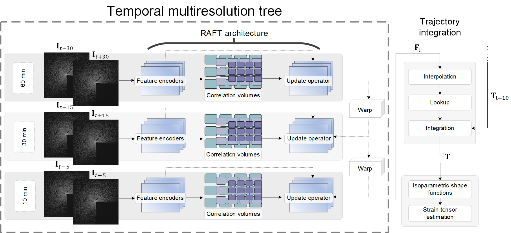

# ICE-RAFT
Matias Uusinoka


Learning-based optical flow tool for full-field analysis of deformation in radar imagery. Work builds on the original RAFT 


When using this code in research, please cite the following publication:
```bibtex
@InProceedings{Gehrig3dv2021,
  author = {Matias Uusinoka, Arttu Polojärvi, Jari Haapala and Mikko Lensu},
  title = {ICE-RAFT: Fine-scale deformation mapping with learning-based optical flow},
  booktitle = {Journal},
  year = {2023}
}
```
